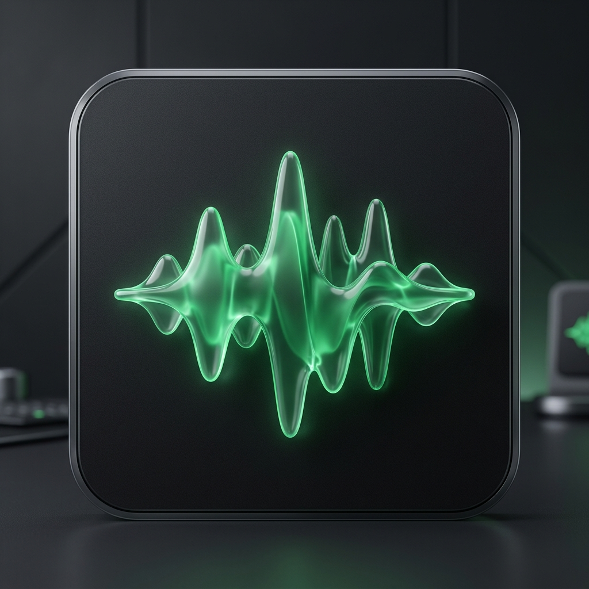
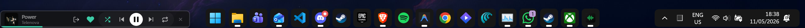

# Spotify Taskbar Widget

  

  
  
  

---

A premium, ultra-slim (35px) Spotify mini-player designed for native desktop integration. Compatible with Windows 11, macOS, and Linux, this widget integrates into your Taskbar or Menu Bar for seamless playback control.

## Performance Comparison

| Feature | Official Spotify App | Spotify Taskbar Widget |
| :--- | :---: | :---: |
| RAM Usage | ~500MB - 1GB+ | **~50MB - 80MB** |
| Footprint | Full Window | **Ultra-Slim 35px** |
| Tech Stack | Electron | **Tauri + Rust** |
| System Impact | High | **Minimal** |
| Integration | Standard Window | **Native Desktop Module** |

## Screenshots

  
   
  <em>Integrated into the Windows 11 taskbar.</em>

  
   
  <em>Dynamic accent colors and polished interface.</em>

## Key Features
- **Precision Fit**: Specifically calibrated 35px height for the Windows 11 taskbar.
- **Cross-Platform**: Intelligent positioning for Windows, macOS, and Linux.
- **Dynamic Theming**: Automatic color extraction from album art for visual integration.
- **High Performance**: Built with Rust for immediate responsiveness and low resource overhead.
- **Background Operation**: Runs in the system tray to maintain a clean workspace.
- **System Integration**: Support for global media keys and auto-focus functionality.

## Technical Overview
The widget serves as a high-performance remote bridge for your Spotify account. Utilizing the official Spotify Web API, it synchronizes playback across devices while consuming significantly fewer resources than the standard desktop client.

## Installation
1. Visit the [Releases](https://github.com/MadalinaCarcea221989/Spotify-Taskbar-Widget/releases) page.
2. Download the installer for your operating system:
   - Windows: .exe or .msi
   - macOS: .dmg
   - Linux: .deb
3. Launch the application and authenticate with your Spotify account.

## Tech Stack

  
  
  
  

## License
This project is licensed under the MIT License. See the LICENSE file for more information.

---

  Built for performance and desktop efficiency.

